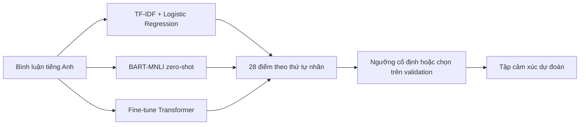

# GoEmotions · Multi-label Emotion Classification


**Phân loại cảm xúc đa nhãn trong bình luận tiếng Anh, từ baseline dễ giải thích đến Transformer.**

[Chạy thử](#quick-start) · [Hướng dẫn](docs/README.md) · [Đọc source](docs/CODE_GUIDE.md) · [Notebook](docs/NOTEBOOKS.md) · [Thực nghiệm](docs/EXPERIMENTS.md)

## Đồ án làm gì?

Một câu có thể vừa cảm ơn, vừa vui hoặc lo lắng. Bài toán trả về một **tập cảm xúc**
trong 28 nhãn GoEmotions: 27 cảm xúc và `neutral`.
Nhóm dùng dữ liệu Reddit tiếng Anh và giữ split chính thức.

| Nhánh | Cách làm | Phần mã |
|---|---|---|
| A · Baseline | TF-IDF + 28 Logistic Regression One-vs-Rest; thử cân bằng lớp và ngưỡng | [Mô hình](src/models/baseline.py), [lệnh chạy](scripts/baseline/) |
| B · Zero-shot | BART-large-MNLI; giữ trọng số, so từng nhãn qua NLI | [Mô hình](src/models/zero_shot.py), [lệnh chạy](scripts/zero_shot/) |
| C · Fine-tuning | BERT, RoBERTa, DistilBERT; 28 logits + BCEWithLogitsLoss | [Mô hình](src/models/transformer.py), [lệnh chạy](scripts/transformers/) |
| D · Demo | Gradio nạp checkpoint C được chọn bằng validation | [app.py](app.py) |

A/B/C chạy độc lập và dùng cùng module đánh giá. Đầu ra A không phải đầu vào bắt buộc của C.



## Quick start

Cần **Python 3.12 hoặc 3.13** và Git. Chạy các lệnh từ gốc repo.

```bash
git clone --branch codex/source-only-repo https://github.com/dzyuu1612/goemotions-multilabel-classification.git
cd goemotions-multilabel-classification
python -m venv .venv
```

Kích hoạt môi trường:

| Hệ điều hành | Lệnh |
|---|---|
| Windows PowerShell | `./.venv/Scripts/Activate.ps1` |
| Windows CMD | `.venv\Scripts\activate.bat` |
| Linux/macOS | `source .venv/bin/activate` |

Cài phần baseline và chạy ví dụ nhỏ, **không tải model hay dataset**:

```bash
python -m pip install -e .
python -m examples.baseline_from_scratch
```

Ví dụ tự tạo minh họa TF-IDF → sigmoid → nhiều nhãn; đây không phải benchmark GoEmotions.

Huấn luyện baseline thật trên CPU rồi dự đoán một câu:

```bash
python -m scripts.baseline.run_baseline
python -m scripts.baseline.predict_baseline --text "Thank you so much for your help!"
```

Lần đầu script tải train/validation ở revision cố định, kiểm SHA-256 và lưu cache.
Model tạo ở `data/processed/baseline/full/`; chưa có model thì cần chạy lệnh huấn luyện trước.
[Cài đặt đầy đủ, CPU/GPU và notebook](docs/GETTING_STARTED.md).

## Bắt đầu đọc từ đâu?

1. [Baseline giải thích từng bước](docs/BASELINE.md): TF-IDF, One-vs-Rest, sigmoid, weighting và ngưỡng.
2. [Bản đồ code](docs/CODE_GUIDE.md): mỗi file làm gì và lệnh tương ứng.
3. [Notebook 01–06](docs/NOTEBOOKS.md): đọc code và giải thích theo thứ tự.
4. [Quy trình A/B/C/D](docs/EXPERIMENTS.md): train → validation → khóa protocol → test → demo.
5. [Giữ kết quả tái hiện được](docs/REPRODUCIBILITY.md) và [xử lý lỗi](docs/TROUBLESHOOTING.md).

## Cấu trúc repo

```text
.
├── src/
│   ├── datasets/       # GoEmotions, hash, multi-hot
│   ├── models/         # Baseline, zero-shot, Transformer, nghiên cứu C3 riêng
│   ├── evaluation/     # Metric, ngưỡng, protocol
│   ├── learning/       # Thuật toán nhỏ viết bằng NumPy để học
│   └── paths.py        # Đường dẫn gốc dùng chung
├── scripts/
│   ├── data/           # EDA
│   ├── baseline/       # Train, predict, tune, freeze, test A
│   ├── zero_shot/      # Chạy BART-MNLI
│   ├── transformers/   # Train/đánh giá ba kiến trúc C
│   ├── distilbert/     # Nghiên cứu riêng của Nhật Huy
│   ├── analysis/       # Tổng hợp số liệu, metadata và lỗi
│   └── pipeline/       # Ghép các bước thực nghiệm
├── notebooks/          # 01_eda → 02_baseline → 03_zero_shot → 04_transformers
├── examples/           # Ví dụ nhỏ chạy trên CPU
├── tests/              # Kiểm dữ liệu giả, metric và protocol
├── configs/            # Cấu hình nghiên cứu C3 riêng
├── requirements/       # Thư viện chia theo nhu cầu
├── docs/               # Hướng dẫn sử dụng và giải thích code
├── tools/              # Kiểm source và tiện ích hỗ trợ
└── app.py              # Demo Gradio của C được chọn
```

## Dữ liệu và đánh giá

Bản `simplified` dùng **43.410 train / 5.426 validation / 5.427 test**.
[Dataset](https://huggingface.co/datasets/google-research-datasets/go_emotions)
và [bài GoEmotions ACL 2020](https://aclanthology.org/2020.acl-main.372/).

- Fit TF-IDF/huấn luyện trên train; chọn checkpoint/cấu hình/ngưỡng trên validation.
- Khóa các lựa chọn trước khi đánh giá test.
- Báo Macro-F1, Micro-F1, Precision/Recall, Hamming Loss và chỉ số từng nhãn.
- Ba kiến trúc C có lệnh chạy ba seed; ba seed đo biến động, không thay tìm kiếm siêu tham số.
- Báo cả nhãn giảm điểm; tuned-validation không thay thế test độc lập.

Xem [cấu hình và giới hạn](docs/EXPERIMENTS.md). Mô hình hiện dùng tiếng Anh; cần đánh giá riêng khi chuyển ngôn ngữ hoặc lĩnh vực.

## Kiểm mã

```bash
python -m pip install -e ".[dev]"
python tools/check_repository.py
python -m unittest discover -s tests -v
```

Để chạy đủ các kiểm Torch, cài thêm extra `transformers` theo hướng dẫn.
CI dùng CPU, dữ liệu giả và mock; không huấn luyện GoEmotions.
[Đóng góp](CONTRIBUTING.md).

## Demo

`app.py` cần checkpoint C và `selected_model.json` do pipeline tạo cục bộ.
Sau khi hoàn thành các bước trong [hướng dẫn thực nghiệm](docs/EXPERIMENTS.md):

```bash
python app.py --device auto
```

Mở `http://127.0.0.1:7860`. Demo trả 28 điểm, ngưỡng và tập nhãn.
[Nghiên cứu/demo DistilBERT riêng](docs/DISTILBERT_STUDY.md).

## Phạm vi bản source

Nhánh này công bố mã, cấu hình, notebook sạch và hướng dẫn.
Dữ liệu tải về, trọng số, output thí nghiệm và các tài liệu Word/PDF giữ ở máy chạy,
được bỏ qua bởi Git. Script vẫn tạo kết quả cục bộ khi bạn thực nghiệm.
Báo cáo học phần và bài IEEE không thuộc bản source này.

**Tác giả Git bản cập nhật:** nguyndy · `baoduynguyen1612@gmail.com`.
Đồ án có bốn thành viên; [ghi nhận đóng góp](NOTICE.md).
[Thư viện, bài nền tảng và repo tham khảo cách trình bày](docs/REFERENCES.md).
